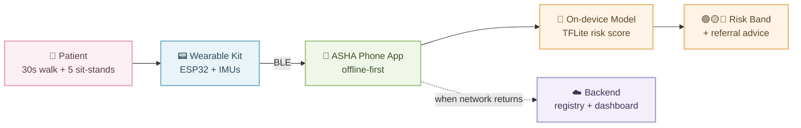
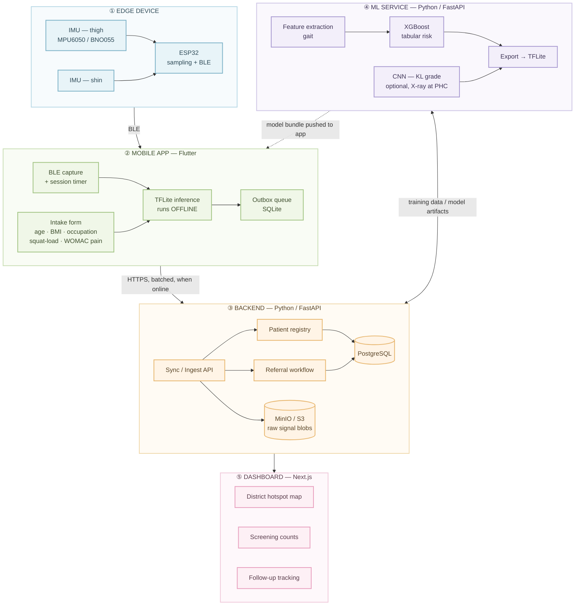
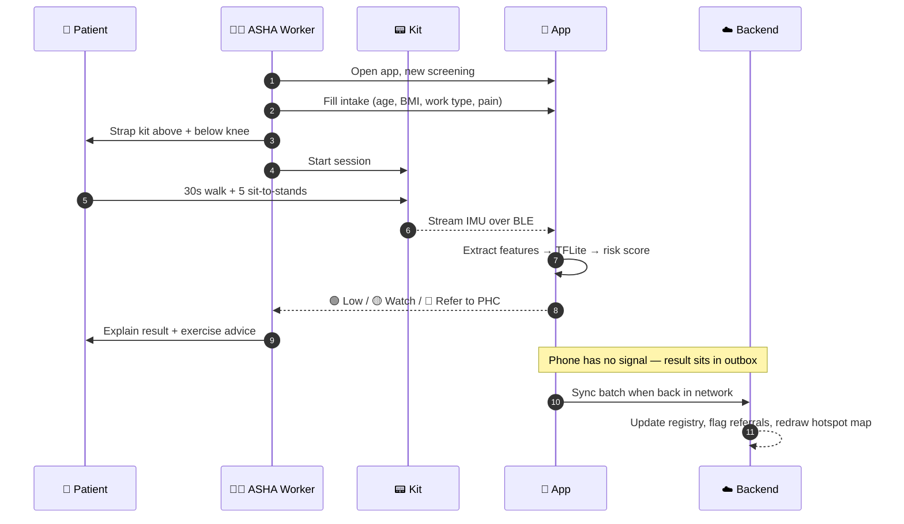
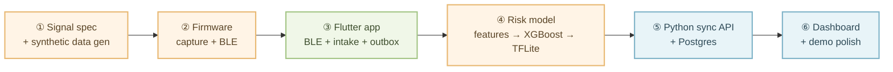

# SIH26004 — AI-Assisted Early Detection of Osteoarthritis Risk Markers (NER)

> **Ministry:** MDoNER · **Track:** Hardware · **Theme:** Space Technology (as listed)
> **One-line pitch:** A field kit + offline AI that lets an ASHA worker screen a village for early knee OA in 3 minutes — no doctor, no X-ray, no internet.

---

## 1. The Product in One Picture

**Why this shape wins:** it is a *hardware* problem statement. A pure web dashboard loses. The judges want to see a physical thing that works in a village with no signal.

---

## 2. System Architecture — 5 Layers

---

## 3. Screening Flow (what actually happens in the village)

---

## 4. Stack — Final Call

| Layer | Choice | Why |
|---|---|---|
| **Firmware** | ESP32 + Arduino/ESP-IDF, BLE | Cheap, BLE built in, huge sensor library support |
| **Sensors** | 2× IMU (MPU6050 or BNO055) | Gait + knee angle |
| **App** | Flutter + SQLite + `flutter_blue_plus` + `tflite_flutter` | One codebase, real offline story, on-device inference |
| **Backend** | **Python** — FastAPI | Compatibility with ML models, quick iteration |
| **DB** | PostgreSQL + MinIO/S3 | Records in PG, raw signal blobs in object store |
| **ML** | Python, FastAPI, XGBoost (+ optional CNN), export TFLite | Tabular model does the heavy lifting; CNN is a bonus |
| **Dashboard** | Next.js + Tailwind + Recharts + MapLibre | Fast to build, looks good on stage |
| **Data** | OAI (Osteoarthritis Initiative) cohort, public KL-graded knee X-ray sets, your own pilot captures | Real citable data > invented numbers |

---

## 5. Build Order — riskiest thing first

**Rule:** the backend is the *least* risky part — build it last. Hardware + model is where teams die.
The synthetic data generator in step ① is what lets the app and model team start before the hardware works.

---

## 6. Things That Decide the Score

| ✅ Do | ❌ Don't |
|---|---|
| Say **"screening / triage, not diagnosis"** everywhere | Claim you diagnose osteoarthritis |
| Show a clear architecture | Pending details |
| Demo with **airplane mode on** | Depend on venue wifi |
| Local-language UI (Assamese / Khasi / Mizo) | Generic English-only app |
| Cite OAI dataset + real NER prevalence numbers | Invent accuracy figures |
| Explain *why NER* — terrain, walking loads, PHC density | Build something that could be for any state |
| One working physical kit on the table | Slides of a kit |

---

## 7. Open Decisions

- **X-ray CNN — in or out?** Only include if you can show it running on a PHC's existing X-ray. Otherwise it's dead weight.
- **Who owns firmware?** This is the single-point-of-failure role. Assign it before anything else.

---

*Screening tool for community health workers. Not a diagnostic device. Any risk flag must route to a qualified clinician.*
