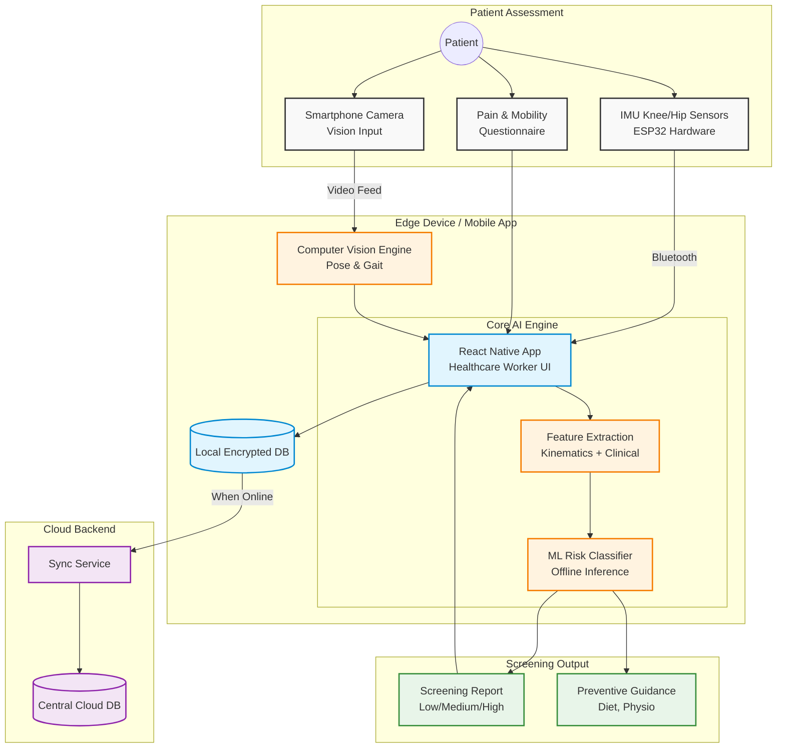

# ORTHO-NER: System Architecture & Vision

## 🎯 What We Are Trying to Achieve

The **Smart India Hackathon Problem Statement SIH26004** asks for an "AI-Assisted Early Detection System for Osteoarthritis (OA) Risk Markers in North Eastern Region (NER)."

Our goal is to build **ORTHO-NER**, a portable, affordable, multimodal screening system designed for rural healthcare workers. It combines **gait**, **posture**, **joint-motion**, and **patient-reported mobility indicators** to identify individuals who should be referred for further Osteoarthritis evaluation.

### Core Objectives
1. **Physical Screening (Hardware):** We must provide a physical assessment component, not just a web app.
2. **Offline-First:** The system must function entirely offline in low-connectivity environments.
3. **Multimodal AI:** Assessing risk using a combination of IMU sensor data, computer vision (camera), and clinical questionnaires.
4. **Empowering Healthcare Workers:** Providing an easy-to-use, multilingual interface that generates clear screening reports (Low/Moderate/High Risk) rather than attempting a definitive medical diagnosis.

---

## 📸 Vision

Here is a conceptual look at how the system will be deployed in the real world.

### The Hardware Component
A clean, wearable sensor strap (containing an ESP32 and IMU sensors) that the patient wears around their knee during the screening. It sends motion data via Bluetooth to the healthcare worker's device.

### The Healthcare Worker App
A mobile application designed for healthcare workers (like ANMs or ASHA workers) operating in rural/remote healthcare camps. It displays the AI-computed risk score and actionable next steps.

---

## 🏗️ Graphical System Architecture

Our solution is divided into distinct, decoupled components to ensure offline capability and ease of deployment.

### How the Data Flows
1. **Data Collection:** The patient undergoes a screening where the healthcare worker records video (Camera), attaches the wearable (IMU), and asks questions in the local language (Questionnaire).
2. **Edge Processing:** The mobile device processes the video using an on-device Pose Estimation model (Computer Vision Engine).
3. **AI Fusion:** The extracted joint angles, stride lengths, hardware accelerometer data, and clinical inputs are fused into a single feature vector.
4. **Offline Inference:** The ML model runs locally on the edge device to output a risk probability.
5. **Report Generation:** A PDF/digital report is generated instantly for the healthcare worker to review and advise the patient.
6. **Synchronization:** Once the healthcare worker returns to an area with internet access, the local encrypted database securely syncs the records to the central cloud.
