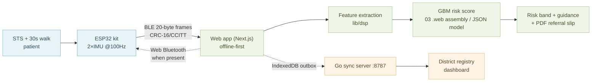

# Tech Architecture — SANDHI (SIH26004) as built

This document describes how the system is **actually implemented** in this repo (this supersedes the earlier design docs that assumed Flutter + Python/FastAPI — the shipped stack is Next.js web + ESP32 firmware + Go sync + Python GBM). For the competitive landscape, see `docs/prior-art.md`.

## 1. System overview



## 2. Layered stack (ground truth in repo)

| Layer | Implementation | Location |
|---|---|---|
| Firmware | ESP32 + 2×IMU, BLE GATT, 20-byte frames @100Hz, CRC-16/CCITT-FALSE | `packages/firmware/esp32_imu/src/` |
| App | **Next.js 15 / React 19 / TS strict**, offline-first web app | `web/app/` |
| BLE client | Web Bluetooth (`lib/dsp/ble.ts`) | `web/lib/dsp/ble.ts` |
| DSP / features | `lib/dsp/features.ts` → `toVector` (27 features) | `web/lib/dsp/` |
| Risk model | Python GBM (LightGBM 178 trees, depth 4, lr 0.055), exported for in-app inference | `ml/gbm.py`, `web/public/data/model.json` |
| Offline queue | IndexedDB outbox, write-through, auto-flush on reconnect | `web/lib/idb.ts`, `web/lib/store.tsx` |
| Sync backend | Go server on `:8787` (`/healthz`, `/v1/screenings`) | referenced from `store.tsx`; not shipped in repo |
| Dashboard | Next.js route, occupation/terrain filters, referral pipeline, camp CSV export | `web/app/dashboard/page.tsx` |
| i18n | en / hi / as / bn, RTL-aware | `web/lib/i18n.tsx` |
| TTS | Web Speech API voice prompts (en/hi/as/bn) | `web/lib/tts.ts` |
| PDF | jsPDF triage slip with QR | `web/lib/pdf.ts` |

### Protocol contract
- Service UUID `6e5a0001-b5a3-f393-e0a9-e50e24dcca9e`
- CHAR_IMU `6e5a0002-…`, CHAR_CONTROL `6e5a0004-…`
- 20-byte IMU frames @100Hz, CRC-16/CCITT-FALSE — implemented identically in firmware (`sandhi_proto.h`) and `lib/dsp/protocol.ts`.

## 3. Where the model counts come from

- Test AUC **0.9277**; bands low `0.095` / refer `0.195`; refer operating point: Se 0.8857, Sp 0.8006.
- 27 features = clinical intake (10) + gait (from **21**) + STS.
- Ablations: intake-only 0.8919 → +gait 0.9281 → full 0.9277 (the kit adds precision; the intake alone is already useful offline).
- Facts live in `web/public/data/metrics.json` and drive the in-app Model kit card.

## 4. Offline-first flow (why it satisfies the NER requirement)

```
record → risk score (on device) → outbox (IndexedDB) → auto-flush (1600 ms after reconnect) → Go :8787
```

- Village has no signal: screening completes end-to-end; PDF printed on a phone/POS printer.
- ASHA returns to connectivity: outbox flushes; referral flags appear on the district dashboard.
- TTS + i18n keep the ASHA-worker interaction language-appropriate and hands-free.

## 5. Module map

```
web/app/
  page.tsx        landing / nav
  screening/      3-phase screen: intake → gait (BLE/sim) → STS → result + PDF/TTS/guidance
  dashboard/      district summary, filters, referral pipeline, camp end-of-day CSV
  registry/       patient register (cohort layer)
  kit/            ESP32 live kit: connect, record 30s walk, score + model card
web/lib/
  dsp/  ble.ts · protocol.ts · features.ts · cohort.ts · simulator.ts
  model/ (toVector / predict glue)
  guidance.ts · pdf.ts · tts.ts · idb.ts · store.tsx · kit.tsx · i18n.tsx · theme.tsx
ml/
  gbm.py · features.py · train.py · train_real.py · simulator.py
packages/firmware/esp32_imu/
  src/main.cpp · src/sandhi_proto.h
```

## 6. Interface points for the SIH demo
1. **Open the web app offline** (airplane mode) — everything still works.
2. **Scan → attach ESP32 kit**, run a 30s walk; live bands update.
3. **Result**: severity chip, structured guidance card, PDF slip with QR, printed output.
4. **Sync**: reconnect → outbox flushes → dashboard referral pipeline lights up.
5. **Multilingual**: flip hi/as/bn; play TTS prompts.

*Screening/triage tool for community health workers — not a diagnostic device. Flags must route to a clinician.*